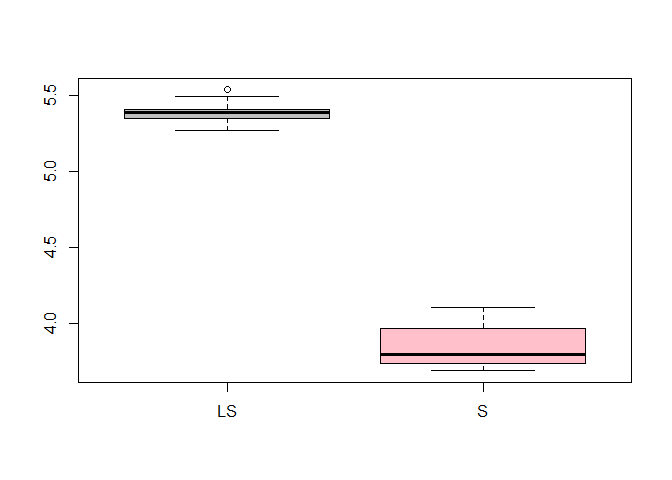

A fast algorithm for S-estimators
================
Matias Salibian
2016-08-22

A fast algorithm for S-estimators for linear regression
-------------------------------------------------------

This repository contains stand-alone `R` code implementing the fast algorithm for S-regression estimators proposed in [Salibian-Barrera, M. and Yohai, V.J. (2006).](http://dx.doi.org/10.1198/106186006X113629). The algorithm is also implemented in the function `robustbase::lmrob` that computes S- and MM-estimators. See the R package [robustbase](http://cran.r-project.org/web/packages/robustbase/index.html) for more information.

Here is a simple example on how to use this code. We first read the function:

``` r
source('fasts.R')
```

We will apply it to the well-known Boston Housing data set.

``` r
data(Boston, package='MASS')
x <- model.matrix(medv ~ ., data=Boston)
y <- Boston$medv
sest <- fast.s(x=x, y=y, int=0, N=500, k=2, best.r=5, seed=123)
```

The arguments of `fast.s` are:

-   x: design matrix, covariates for each observation in rows
-   y: vector of responses
-   int: if equal to 1 a column of ones is added to x. This corresponds to including an intercept in the fitted model.
-   N: number of random sub-samples to be generated
-   k: number of refining iterations in each subsample. k = 0 means "raw-subsampling"
-   b: right hand side of the M-scale equation. Defaults to 0.50 yielding a highly-robust estimator.
-   cc: tuning constant corresponding to the argument `b` above to ensure consistency.
-   best.r: number of partially refined candidates to retain. These are finally iterated until convergence.
-   seed: seed used in the generation of the random sub-samples.

We can compare the S- and LS-estimators:

``` r
lmest <- lm(medv ~ ., data=Boston)
round(cbind(sest[[1]], coef(lmest)), 3)
```

    ##               [,1]    [,2]
    ## (Intercept)  8.116  36.459
    ## crim        -0.142  -0.108
    ## zn           0.036   0.046
    ## indus        0.034   0.021
    ## chas         2.346   2.687
    ## nox         -3.369 -17.767
    ## rm           4.844   3.810
    ## age         -0.044   0.001
    ## dis         -0.717  -1.476
    ## rad          0.064   0.306
    ## tax         -0.006  -0.012
    ## ptratio     -0.540  -0.953
    ## black        0.013   0.009
    ## lstat       -0.247  -0.525

The estimated residual scales are

``` r
round(c(sest[[2]], summary(lmest)$sigma), 2)
```

    ## [1] 2.72 4.75

An interesting experiment is to compare the prediction properties of the robust and least squares estimator. In order to do this, we will use 10-fold CV, and, compare the squared prediction errors of each estimator. To avoid penalizing poor predictions of outlying observations, we will compute the mean squared prediction error of the 75% smallest residuals (in other words, we will use a 25% trimmed mean squared prediction error):

``` r
tms <- function(e, trim=0.25) {
  es <- sort(e^2)
  n <- length(e)
  return( mean( es[1:floor(n*(1-trim))] ) )
}
```

The following chunck of code runs 10-fold CV and computes the S- and the LS- predictions.

``` r
n <- dim(x)[1]
k <- 10
set.seed(123)
ii <- sample( (1:n) %% k + 1)
pr.s <- pr.ls <- rep(NA, n)
for(j in 1:k) {
  trs <- (ii != j)
  tr.x <- x[ trs, ]
  tr.y <- y[ trs ]
  ses <- fast.s(x=tr.x, y=tr.y, int=0, N=500, k=2, best.r=5, seed=123)
  lses <- lm(medv ~ ., data=Boston, subset = trs)
  pr.ls[ !trs ] <- predict(lses, newdata = Boston[ !trs, ])
  pr.s[ !trs ] <- as.vector( x[ !trs, ] %*% ses[[1]] )
}
```

The resulting trimmed mean squared prediction errors are

``` r
tms( (y - pr.ls) )
```

    ## [1] 5.430046

``` r
tms( (y - pr.s) )
```

    ## [1] 4.073133

showing that the S-estimator produces better predictions for the majority of the data. This phenomenon is observed when you repeat the above experiment using different 10-fold partitions. Below are the boxplots of the trimmed mean squared prediction errors obtained with 10 runs of the above experiment: 
